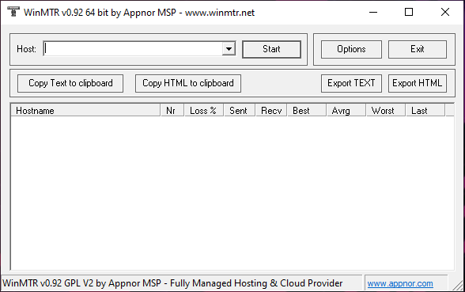
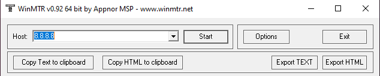

### FTL SUPPORT DOCUMENTATION:  
Diagnosing a fault with "FTL" isn't as easy, as diagnosing a fault with "RTMP". The first things you've
got to remember, is that FTL transports data over **UDP** and not **TCP** and so it's unfettered and relies on
 your internet connection being **100% stable**.  
  
One of the first issues most will have with **FTL** will be connection issues, and your standard **Speed** test
will not identify an issue with **UDP** and so will always be a false **Negative/Positive** identifier. In order 
to identify an issue with **UDP**, you will need to run a **UDP** Speed test, and you can do this by clicking 
the below link.  
  
[UDP Speed Test](https://testmy.net/) | **Currently Offline**  
  
With **UDP** testing, what you are looking for is **Jitter** & **Latency**. With the above test when it works, 
you will get a graph at the bottom of your speed test and ideally what you are looking for, is a steady line, that 
doesn't dip too much and remains stable.

You can also check with the company who supplies the **UDP** connection, such as a **Streaming Platform**, if they 
 have their own **UDP** test, as they should receive a full detailed output of the test you've done, if done via
 their website or **UDP** test connection.

If they don't have the necessary **UDP** test on their servers, then you will need to provide further information 
when raising an issue with your connection, the below are recommended testing software for connection issues.

[WinMTR](https://sourceforge.net/projects/winmtr/)  
  
WinMTR (My Traceroute), is a more advanced feature of the CMD line **Tracert**  
  

In **Host:** Enter the IP address to test your connection to, ideally this will be to the route you are connecting 
with, as you want to be making sure you've got no issues with the route to the address.  

  

Once you've added the IP address, hit start, and the program will start to trace the route of your connection.  

