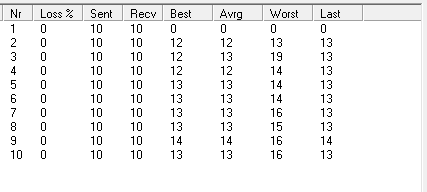
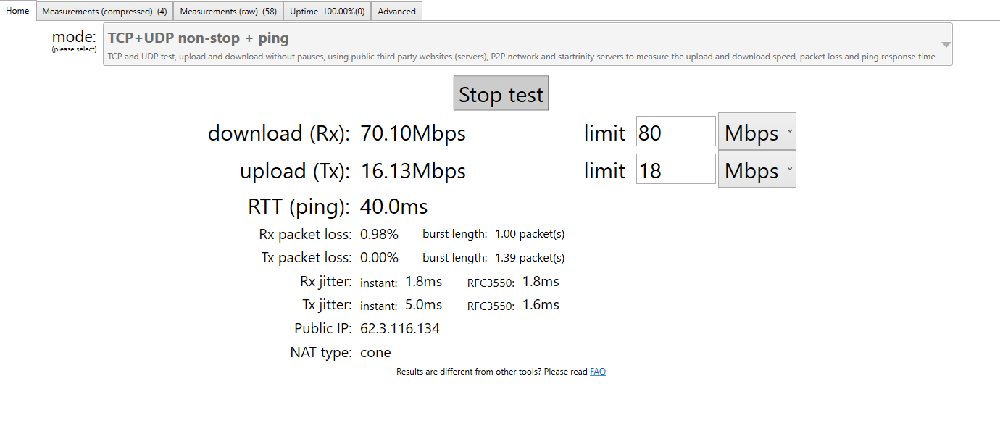
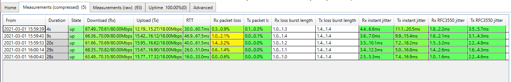
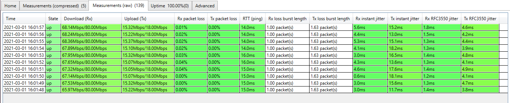
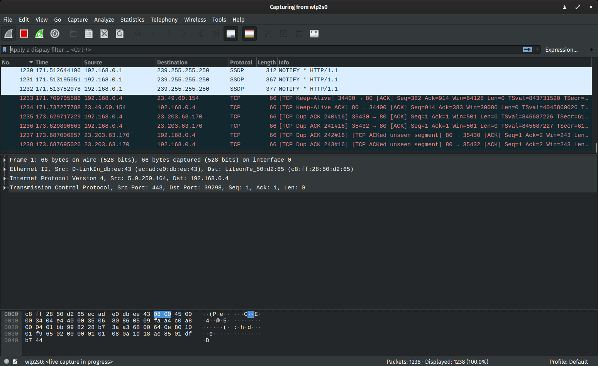

### FTL SUPPORT DOCUMENTATION:  
Diagnosing a fault with "FTL" isn't as easy, as diagnosing a fault with "RTMP". The first things you've
got to remember, is that FTL transports data over **UDP** and not **TCP** and so it's unfettered and relies on
 your internet connection being **100% stable**.  
  
One of the first issues most will have with **FTL** will be connection issues, and your standard **Speed** test
will not identify an issue with **UDP** and so will always be a false **Negative/Positive** identifier. In order 
to identify an issue with **UDP**, you will need to run a **UDP** Speed test, and you can do this by clicking 
the below link.  
  
[UDP Speed Test](https://testmy.net/) | **Currently Offline**  
  
With **UDP** testing, what you are looking for is **Jitter** & **Latency**. With the above test when it works, 
you will get a graph at the bottom of your speed test and ideally what you are looking for, is a steady line, that 
doesn't dip too much and remains stable.

You can also check with the company who supplies the **UDP** connection, such as a **Streaming Platform**, if they 
 have their own **UDP** test, as they should receive a full detailed output of the test you've done, if done via
 their website or **UDP** test connection.

If they don't have the necessary **UDP** test on their servers, then you will need to provide further information 
when raising an issue with your connection, the below are recommended testing software for connection issues.

[WinMTR](https://sourceforge.net/projects/winmtr/)  
  
WinMTR (My Traceroute), is a more advanced feature of the CMD line **Tracert**  
  

In **Host:** Enter the IP address to test your connection to, ideally this will be to the route you are connecting 
with, as you want to be making sure you've got no issues with the route to the address.  

  

Once you've added the IP address, hit start, and the program will start to trace the route of your connection.  
  
Leave the test running for roughly 20 minutes and if there are no issues, it should look as clean as the one above. 
However, if you notice **%loss** on one of the routes (The ones between your localhost & connected site, in our 
case, it is the jumps between 2 - 9).  

 This is a routing path, which is identified as such by the FQDN. If you have an issue 
with drops on one of these, these are run by **Third Parties** and unfortunately if the drop is on one of these, unless 
it is a **Provider FQDN** (Ours shows as ZEN, which is our provider), then there is not a lot you can do, other than 
to report it. 9/10 it won't get fixed, unless it is a major disruption. If it's a provider one, they can check 
for any faults within their distribution network.  
  
We also use a CST (Continuous Speed Test) and network monitoring software, which are listed below.

[Star Trinity CST](http://startrinity.com/InternetQuality/ContinuousBandwidthTester.aspx)  
  
  
  

With the CST, this is ideal to be run when you're using the service you are connected to, which like with **Wireshark**, 
you can export the information and send it, as part of your detailed analysis of your connection.
  
[Wireshark](https://www.wireshark.org)  

Wireshark monitors your overall connection, what is coming in and what is going out and to the untrained eye, it 
can be very confusing. However, to someone in a **Support** role, Wireshark holds a lot of information and will make 
identifying any issues with connection much easier.

By using all the above when checking for connection issues over UDP and supplying the **Support Team** with all the information, 
this will allow them to identify any issues quickly, which would also cut down the time required for any "Diagnostics" to be done, 
as you will have already provided the **Essentials** to investigate further.  
  
But always remember one key element,   

**ALWAYS SWITCH YOUR ROUTER OFF AND ON AGAIN, TO RESET YOUR CONNECTION BEFORE RUNNING ANY TEST**
